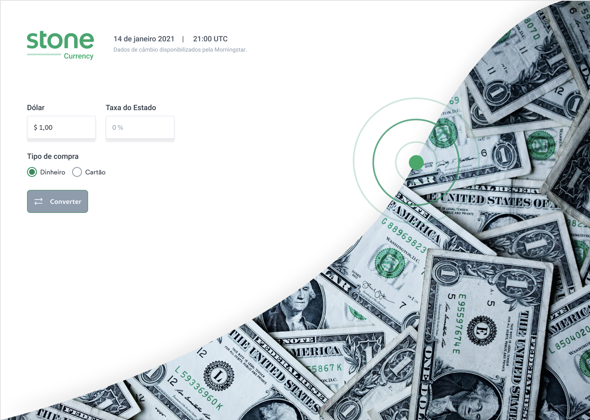

<h1 align="center">
    
</h1>

<p align="center">
  <a href="#-technologies">Technologies</a>&nbsp;&nbsp;&nbsp;|&nbsp;&nbsp;&nbsp;
  <a href="#-layout">Getting started</a>&nbsp;&nbsp;&nbsp;|&nbsp;&nbsp;&nbsp;
  <a href="#-project">Project</a>&nbsp;&nbsp;&nbsp;|&nbsp;&nbsp;&nbsp;
  <a href="#-layout">Layout</a>&nbsp;&nbsp;&nbsp;|&nbsp;&nbsp;&nbsp;
  
</p>

<p align="center">
  
  
  

  
</p>

<br>

<p align="center">
  
</p>

---

## 🧪 Technologies

This project was developed using the following technologies:

- [React Native](https://reactnative.dev/)
- [Styled Components](https://styled-components.com/)
- [Axios](https://www.npmjs.com/package/axios)
- [date-fns](https://date-fns.org/)

## 🚀 Getting started

Clone the project and access the folder

```bash
$ git clone https://github.com/JorgeFPeres/Stone_Currency.git  && cd Stone-Currency
```

Follow the steps below

```bash
# Install the dependencies
$ yarn install

# Start the project
$ yarn start
```

## 💻 Project

[Stone Currency](https://currencystone.netlify.app/)
Currency app to convert Dolar to Real including tax and IOF for any option (money or credit card).

This is a tech challenge presented by **[@Stone](https://www.stone.com.br/)**.

## 🔖 Layout

You can view the project layout through the links below:

- [Layout](https://www.figma.com/file/y8IcDbllfaFAzXrEXR05PE/Teste---Front-Web-Stone?node-id=0%3A1)

Remembering that you need to have a [Figma](http://figma.com/) account to access it.

---

Made with ❤️ by Jorge F Peres
